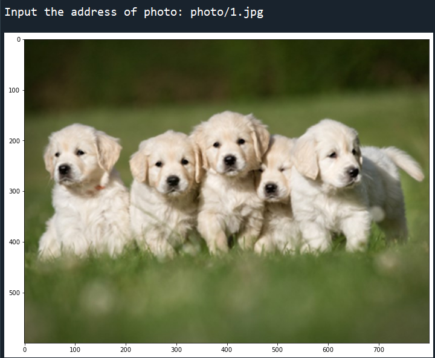
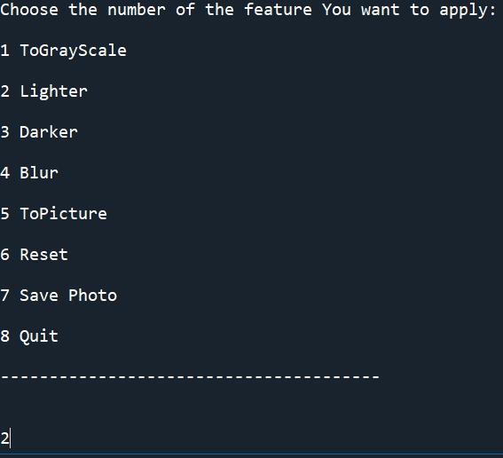
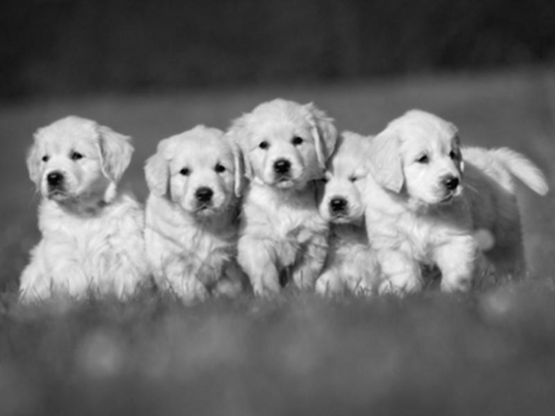
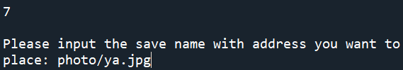

# PhotoEditor
> - 可將照片轉成灰階、調整亮度、模糊化、轉成圖畫  
> - 實作語言: `Python`
> - 影像處理課程之期末專題
## Execution
1. 輸入要編輯的照片位址，它會秀出照片。 
  

2. 顯示所有功能，選取想使用的功能號碼。 
  

- ToGrayscale : 轉成灰階 
  

- Lighter : 變亮 
  

- Darker : 變暗 
  

- Blur : 模糊 
  

- ToPicture : 圖畫化 
  

- Reset: 回復原狀 

- Save Photo: 儲存圖片
  
